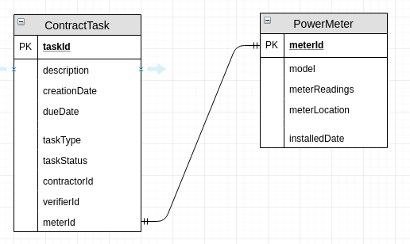

# MiniHackathon2019

This is the repo for the MiniHackaton in Rotterdam on 5th and 12th september 2019.

# Our solution: Minimalizing the hassle and human error when registering subcontractor services
A subcontractor is an individual (or in many cases: a business) that signs a contract to perform part or all of the obligations of another's contract. These obligations often consist of certain services that need some sort of registration, in order to keep the workflow going. We want to register services from subcontractors in order to minimalize the hassle and possibility of human errors, in order to sustain a steady workflow.

As an example, we will discuss the case of a mechanic who needs to (re)place a power meter.

# The case: Registering power meter maintainance on the blockchain
Sometimes, a power meter needs to be (re)placed within a house. This can happen if a meter breaks, a freshly built house gets its first meter, or an existing meter is replaced with a newer, “smarter” version. Grid-operators, like Stedin for example, need to hire subcontractors (in this case: mechanics) to do the job at the home of the end-user (the one who pays the electric bills).
After the job has finished, the service provided needs to be registered so that the subcontractor can be paid. And, in this case, this also means the current power meter readings need to be noted and sent to the energy company (like Eneco). It is crucial this is done correctly, In order to make sure the end-user does not pay unnecessary fees.
We want to solve the hassle of registration and possible human errors by using Hyperledger Fabric as our registration tool.

# Actors
We have four actors present in this scenario:
    • The contractor (grid operator): Issues tasks to a subcontractor and closes them when done.
    • The subcontractor (mechanic): registers the given task as done, with the required information (power meter readings).
    • The end-user (house owner/renter): Verifies performed task by the subcontractor.
    • Optional: The registration (energy company): Views task information (power meter stands).
    
# Entities

# jsons

ContractTask
{
   "verifierId":"Jan Jansen",
   "contractorId":"abc",
   "meterId":"meter002",
   "dueDate":"2019-10-12 00:00:00",
   "description":"Description",
   "id":"task001",
   "creationDate":"2019-09-12 13:15:000",
   "type":"REPLACE",
   "status":"TODO"
}

Meter
{
   "meterReadings":"123",
   "installDate":"2019-09-12 12:34:22",
   "model":"Slim",
   "location":"myPlace",
   "id":"001"
}

# api
View subcontractorapi.json in root folder for the API (controller) defs. These will be generated into a functional Awagger API.

# How can we ensure trust in this system when it's in production?
The owner and subcontractor both have nodes running, in order to make sure we can trust the administration of the performed tasks.

# What will be built?
The application will consist of the following:
    • Node-RED (for a simple frontend to be used by the end-users)
    • Running (parly loopback generated) Typescript Swagger-UI (as backend service between the frontend and ledger)
    • Running Hyperledger Fabric (with chaincode written in Java
